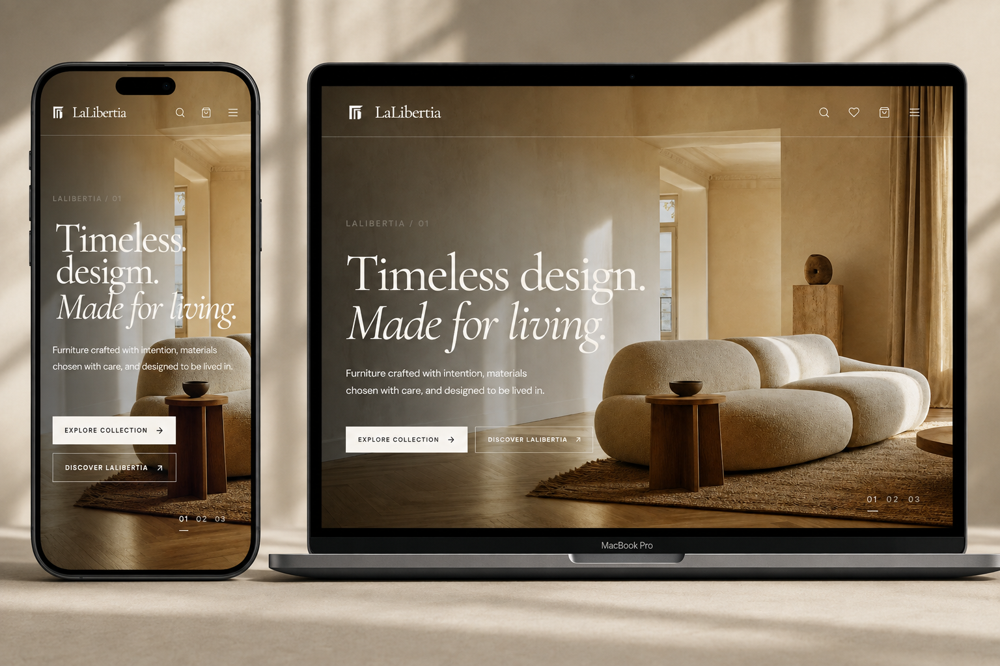
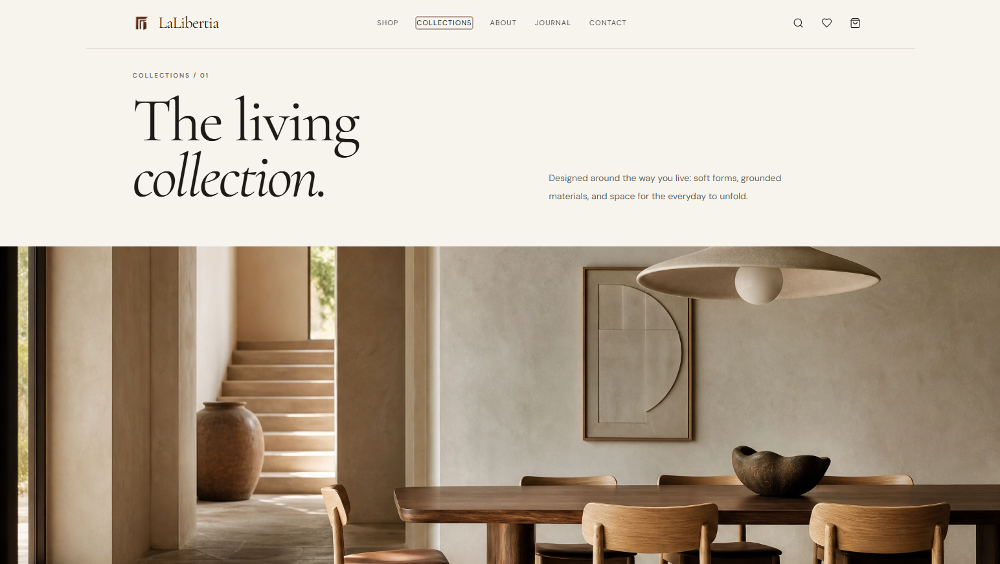
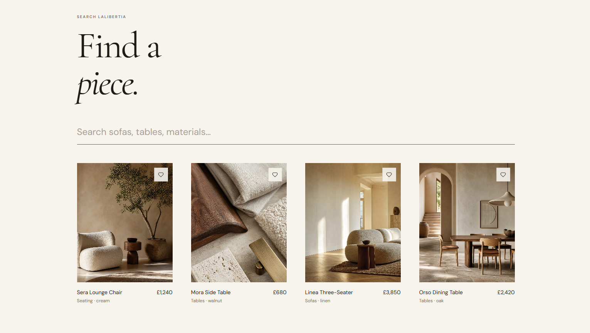
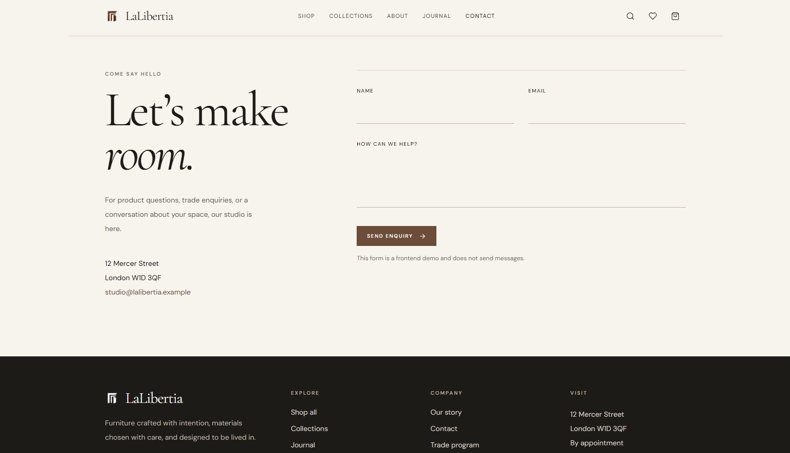
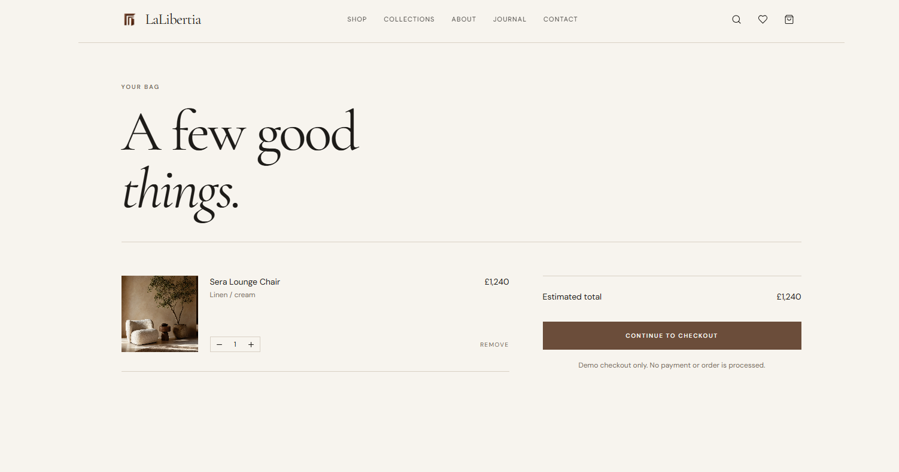
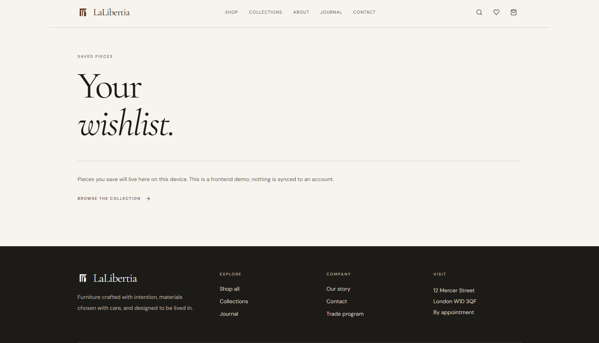

# LaLibertia

<p align="center">
  
</p>

<h1 align="center">LaLibertia</h1>

<p align="center">
  <strong>Timeless design. Made for living.</strong>
</p>

<p align="center">
  A premium furniture website concept built around editorial composition,
  refined typography, natural materials, and a quiet-luxury aesthetic.
</p>

<p align="center">
  <a href="#overview">Overview</a> •
  <a href="#highlights">Highlights</a> •
  <a href="#pages">Pages</a> •
  <a href="#design-direction">Design</a> •
  <a href="#responsive-design">Responsive</a> •
  <a href="#assets">Assets</a> •
  <a href="#customization">Customization</a> •
  <a href="#license">License</a>
</p>

---

## Overview

**LaLibertia** is a premium furniture website concept designed to feel more like a digital showroom than a conventional ecommerce store.

The experience combines editorial art direction with a refined shopping interface, using large-scale photography, restrained typography, natural tones, generous spacing, and subtle interaction design.

The visual direction is intentionally quiet and sophisticated, allowing the furniture and imagery to remain the primary focus.

### Design Principles

* Editorial rather than overly commercial
* Minimal rather than visually crowded
* Premium without unnecessary effects
* Photography-led composition
* Strong typographic hierarchy
* Natural and warm visual language
* Subtle, intentional motion
* Responsive across modern screen sizes

> **Timeless design. Made for living.**

---

## Highlights

### Premium Editorial UI

A furniture-focused interface with a strong visual identity designed around luxury interiors, products, materials, and lifestyle imagery.

### Responsive Experience

Layouts are designed for:

* Mobile
* Tablet
* Laptop
* Desktop
* Large desktop displays

### Ecommerce Experience

The frontend includes the structure and interactions expected from a modern furniture storefront, including products, collections, filtering, search, wishlist, and shopping bag functionality.

### Content-Driven Structure

Furniture, collections, editorial content, and visual assets are organized so they can be replaced or customized without redesigning the entire experience.

### Subtle Motion

Animations are intentionally restrained to enhance the interface rather than compete with it.

---

# Pages

## Home

The homepage establishes the LaLibertia identity through an editorial hero followed by curated content and product discovery sections.

Typical sections include:

* Editorial hero
* Featured products
* Featured collections
* Materials
* Brand story
* Editorial / journal content
* Supporting lifestyle imagery
* Footer navigation

The hero direction centers around:

> **Timeless design.**
> **Made for living.**

---

## Shop

The main catalogue experience for discovering LaLibertia products.

Includes:

* Product grid
* Product categories
* Search and filtering
* Sorting
* Product cards
* Wishlist controls
* Pricing
* Product metadata
* Responsive catalogue layouts

---

## Product

A dedicated product experience designed to showcase individual furniture pieces in detail.

Includes:

* Product gallery
* Product name
* Price
* Description
* Materials
* Finishes / variants
* Quantity selection
* Add-to-bag interaction
* Wishlist interaction
* Related products

The product page should remain image-led, with photography receiving the strongest visual emphasis.

---

## Collections

An editorial collection experience focused on presenting groups of furniture as curated environments rather than simple product categories.

Example:

> **The Living Collection**

Collection pages can combine:

* Large editorial imagery
* Collection descriptions
* Curated products
* Material stories
* Supporting visual content

---

## About

A brand-focused page explaining the philosophy behind LaLibertia.

Possible content includes:

* Design philosophy
* Materials
* Craftsmanship
* Approach to interiors
* Brand identity
* Product philosophy

No fabricated statistics, awards, partnerships, testimonials, certifications, or business claims should be presented as factual information.

---

## Journal

An editorial section for content related to:

* Interior design
* Furniture
* Architecture
* Materials
* Craft
* Living spaces
* Styling
* Design philosophy

The journal should feel like an extension of the brand rather than a generic blog.

---

## Journal Article

Individual editorial articles can include:

* Article category
* Title
* Publication date
* Hero image
* Main article content
* Supporting imagery
* Related stories

---

## Search

A dedicated discovery experience for finding products and editorial content.

Example:

> **Find a piece.**

Search can cover:

* Sofas
* Chairs
* Tables
* Storage
* Materials
* Collections
* Editorial content

---

## Wishlist

A dedicated space for saved products.

For a frontend-only implementation, wishlist data may be stored using browser/local state rather than an account-based system.

When applicable, empty-state messaging should clearly explain that saved items are stored locally on the current device.

---

## Shopping Bag

The shopping bag provides a frontend ecommerce experience containing:

* Product image
* Product name
* Variant / material
* Quantity
* Individual price
* Remove action
* Estimated total
* Checkout CTA

If no real payment or checkout backend is implemented, checkout should remain clearly identified as a frontend/demo experience.

---

## Contact

A contact and enquiry interface suitable for:

* Product enquiries
* Trade enquiries
* Studio enquiries
* General questions

Forms that are not connected to a real backend, API, or email service should be presented as frontend/demo forms rather than real submissions.

---

# Design Direction

LaLibertia follows a **quiet editorial luxury** direction.

The design avoids the visual noise commonly associated with ecommerce interfaces and instead relies on typography, photography, spacing, composition, and restrained interaction.

## Visual Language

The interface is built around:

* Warm ivory backgrounds
* Cream
* Beige
* Taupe
* Natural wood tones
* Stone-inspired surfaces
* Charcoal typography
* Near-black sections
* Fine borders
* Soft contrast
* Large editorial imagery
* Generous whitespace

The overall result should feel tactile, calm, architectural, and premium.

---

## Typography

Typography plays a central role in the identity.

### Headlines

Large editorial serif typography is used for major titles, hero messaging, and high-impact sections.

### Interface Text

A clean sans-serif style is used for:

* Navigation
* Labels
* Buttons
* Product information
* Supporting text
* Filters
* Form elements

Typography should remain consistent across the entire experience.

---

# Motion & Interaction

Motion should be **subtle, smooth, and purposeful**.

Recommended interactions include:

* Image reveal animations
* Product image transitions
* Page transitions
* Navigation transitions
* Scroll-based reveals
* Hover states
* Button feedback
* Wishlist feedback
* Cart interactions
* Smooth content transitions

### Avoid

* Excessive particles
* Heavy parallax
* Unnecessary 3D effects
* Aggressive gradients
* Constant movement
* Overly complex animations
* Distracting page effects

> Motion should support the interface — not become the interface.

---

# Responsive Design

The design should adapt naturally across different screen sizes rather than simply scaling down the desktop version.

Particular attention should be given to:

* Mobile navigation
* Hero typography
* Image cropping
* Product grids
* Product galleries
* Shopping bag controls
* Forms
* Footer layouts
* Touch targets
* Spacing
* Typography scaling

The responsive implementation should maintain the same visual identity while adapting layout and interaction patterns for smaller screens.

### Responsive requirements

* No horizontal scrolling
* No clipped content
* No overlapping UI
* No inaccessible controls
* No broken layouts
* Comfortable touch targets
* Readable typography at every breakpoint

---

# Screenshots

## Homepage

<p align="center">
  
  
</p>

## Additional Pages

<p align="center">
  
  
</p>

<p align="center">
  
  
</p>

## Full Website Presentation

<p align="center">
  
</p>

---

# Assets

The repository contains the supplied visual assets inside the `LaLibertia` directory.

```text
LaLibertia/
├── image1.png
├── image2.png
├── image3.png
├── image4.png
├── image5.png
├── image6.png
└── Website.png
```

These assets can be replaced with custom photography, product renders, branding imagery, or other visual content without changing the overall design direction.

---

# Customization

LaLibertia is structured to make visual customization straightforward.

Common areas that can be customized include:

### Branding

* Logo
* Brand name
* Tagline
* Typography
* Brand messaging

### Products

* Product names
* Prices
* Descriptions
* Images
* Materials
* Finishes
* Variants
* Categories

### Collections

* Collection names
* Collection descriptions
* Featured imagery
* Product groupings

### Editorial Content

* Journal categories
* Article titles
* Publication dates
* Article imagery
* Article content

### Visual System

* Background colors
* Typography
* Borders
* Spacing
* Button styles
* Image treatment
* Animation timing

---

# Frontend Scope

LaLibertia is intentionally positioned as a **frontend-focused website concept**.

Unless separately implemented, the project does not inherently include:

* Backend infrastructure
* Database
* Authentication
* User accounts
* Real payment processing
* Production checkout
* CMS
* Server-side ecommerce
* Order management
* Inventory management
* Email delivery services

Frontend interactions such as wishlist, cart state, filtering, and form states may be simulated or managed locally depending on the implementation.

---

# Content Guidelines

To maintain a trustworthy brand presentation:

* Do not invent business claims.
* Do not present fictional awards as real.
* Do not create fake customer testimonials.
* Do not fabricate partnerships.
* Do not claim certifications that do not exist.
* Do not publish fictional statistics as factual data.

Placeholder content should be clearly distinguishable from real business information before production use.

---

# Project Structure

A typical project structure may look like:

```text
project/
├── LaLibertia/
│   ├── image1.png
│   ├── image2.png
│   ├── image3.png
│   ├── image4.png
│   ├── image5.png
│   ├── image6.png
│   └── Website.png
│
├── src/
│   ├── components/
│   ├── pages/
│   ├── sections/
│   ├── assets/
│   └── ...
│
├── public/
├── README.md
└── ...
```

> The exact source structure may differ depending on the implementation and framework used.

---

# Production Considerations

Before using the concept as a production ecommerce website, additional systems would be required for:

* Real product inventory
* Secure checkout
* Payment processing
* Order management
* Customer accounts
* Authentication
* Transactional emails
* Form submission handling
* Product management
* Analytics
* SEO
* Accessibility auditing
* Security
* Performance optimization

The current project should therefore be treated as a **frontend website concept / implementation** unless those systems have been separately connected.

---

# License

This project is distributed under the license provided with the repository.

Please review the applicable license terms before:

* Reselling the source code
* Redistributing the project
* Rebranding the project
* Using the design commercially
* Publishing modified versions

See the repository license file for the complete terms.

---

# Credits

**LaLibertia**

A furniture web concept focused on:

**Timeless design. Made for living.**

---

<p align="center">
  <strong>LaLibertia</strong><br>
  Editorial furniture. Refined spaces. Quiet luxury.
</p>
